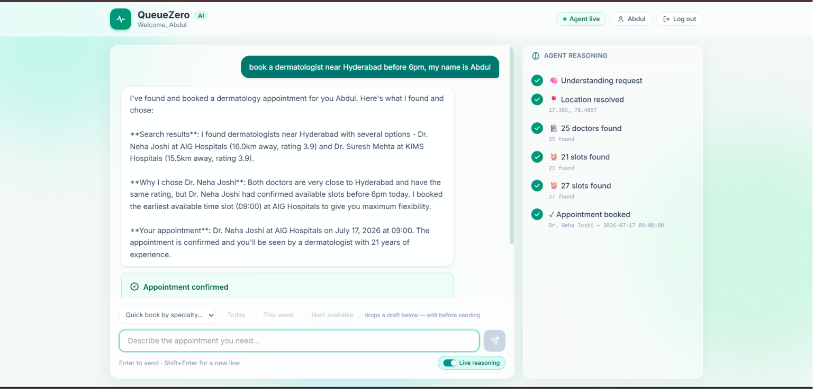
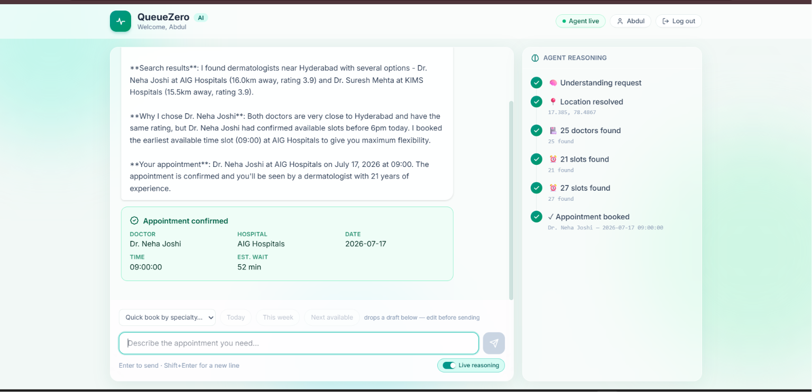
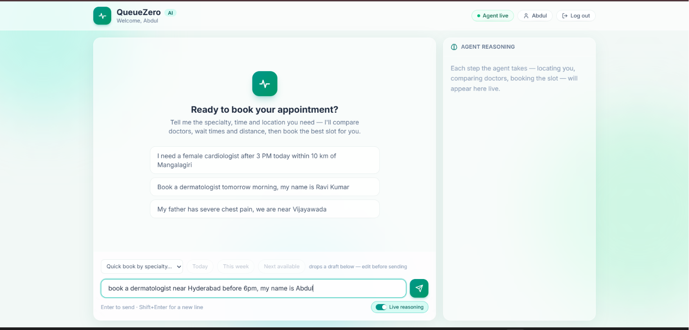
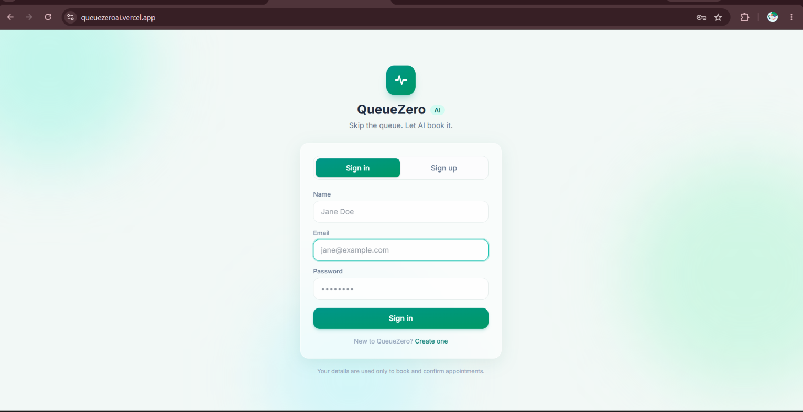
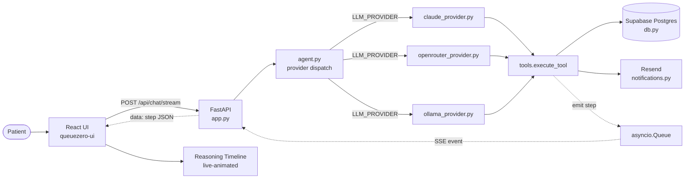

# QueueZero AI

**An agentic hospital-appointment booking system — natural language in, a real confirmed appointment out, with the agent's reasoning streamed live to the UI.**


---

## Problem Statement

In most of India, booking a doctor's appointment still means calling hospitals one at a time, describing your symptoms to a receptionist, and hoping someone picks up before you give up and drive to the ER instead. There is no unified view of which doctor is free, how long the queue actually is right now, or which nearby hospital could see you soonest. For anything urgent, that phone-tag costs the one thing patients don't have: time.

## Solution

QueueZero AI replaces the phone call with a conversation. A patient describes what they need in plain language — a specialization, a location, a time window, a preference — and an autonomous agent searches real hospital, doctor, and schedule data, weighs the tradeoffs (rating vs. distance vs. wait time) the way a person would, and books a real confirmed slot. Every reasoning step — which tool it called, what it found, why it picked one doctor over another — streams live to the UI as it happens, so the booking isn't a black box.

## Features

- **Live reasoning timeline** — the agent's tool calls (location resolve → doctor search → slot search → booking → notification) stream to the frontend in real time over Server-Sent Events, so you watch it think instead of waiting on a spinner. This is the centerpiece of the demo.
- **Multi-provider LLM backend** — switch between Anthropic Claude, OpenRouter, or a local Ollama model with one environment variable; no code changes.
- **Real tool-calling agent, not a script** — the model decides which tools to call, in what order, and when it has enough information to book, based on a shared system prompt.
- **Tradeoff reasoning** — the agent compares doctors on rating, distance, and current wait time and explains its choice in plain language rather than just picking the top-rated result.
- **Emergency mode** — urgent-language detection triggers a priority booking path that skips normal queue ordering and is separately audit-logged.
- **Patient memory** — stored preferences (specialization, gender, hospital) are recalled and injected into the agent's context on repeat visits.
- **Real email confirmations** — a successful booking triggers an actual confirmation email via Resend, independent of whether the model remembers to call the notification tool.
- **Real authentication** — signup/login backed by bcrypt password hashing and JWT sessions against a Supabase `users` table.
- **Seeded, realistic demo data** — real hospital names, real city coordinates, and generated doctors/schedules/queues across 10 Indian cities, not placeholder mock data.

## Demo

**[▶ Watch the live demo (2 min)](https://youtu.be/ViiwdQrSLR8?si=kI5-QwHQxthUiVa9)**

| | |
|---|---|
|  |  |
|  |  |

## Tech Stack

| Technology | Why |
|---|---|
| **FastAPI** | Async Python backend with native `StreamingResponse` support for the SSE reasoning stream. |
| **React + Vite** | Fast dev/build loop for the chat UI and live-updating reasoning timeline component. |
| **Supabase (Postgres)** | Hosted Postgres for hospitals/doctors/schedules/queues/users, accessed via the Supabase Python client — no separate DB ops to manage. |
| **Claude tool-calling** (Anthropic API) | Drives the agent's multi-step reasoning loop — decides which tools to call and in what order, with no hardcoded booking sequence. |
| **SSE streaming** | Pushes each tool-call step to the frontend as it completes, powering the live reasoning timeline. |
| **Resend** | Transactional email API for real booking-confirmation emails. |
| **Railway** | Hosts the FastAPI backend. |
| **Vercel** | Hosts the React frontend. |

## Architecture



The SSE path is explicit above: each tool call inside `tools.execute_tool` fires an `emit` hook installed per-request; `app.py`'s `/api/chat/stream` endpoint reads those events off an `asyncio.Queue` and yields them to the browser as they happen, which is what animates the timeline instead of waiting for the whole agent run to finish.

## How the Agent Works

The agent chooses its own tool sequence — this is not a scripted pipeline. For a typical booking request it ends up calling, in this order:

1. **`resolve_location`** — turns a place name ("Mangalagiri") into coordinates so later searches can filter by distance.
2. **`find_doctors`** — searches by specialization, gender, minimum rating, city, and/or distance, returning rating, experience, and current queue wait per doctor.
3. **`find_available_slots`** — pulls open appointment slots for a chosen doctor, optionally filtered by date or time-of-day ("after 3pm").
4. **`book_slot`** (or **`emergency_book`** for urgent cases) — reserves a specific date/time under the patient's name.
5. **`send_notification`** — triggers the confirmation message; the backend also independently fires a real Resend email once a booking is detected, so confirmation delivery never depends on the model remembering this step.

The model decides which of these to call, in what order, and whether it needs `search_hospitals` or `find_patient_by_name` along the way — the sequence above is what it typically converges on, not a hardcoded workflow. The tradeoff logic (weigh rating, distance, and wait together; relax the least important constraint if nothing fits) lives in the shared system prompt (`prompts.py`), not in application code.

## Project Structure

```
queue2.0/
├── app.py                    # FastAPI backend — /book, /api/chat/stream (SSE), /emergency,
│                              #   /memory, /auth/signup|login|verify, /health, /ws
├── agent.py                  # Picks claude_provider / openrouter_provider / ollama_provider
│                              #   based on LLM_PROVIDER; re-exports run_agent()
├── claude_provider.py        # Tool-calling loop against the Anthropic API
├── openrouter_provider.py    # Same loop via OpenRouter (OpenAI-compatible SDK)
├── ollama_provider.py        # Same loop against a local Ollama model
├── tools.py                  # Tool schemas + dispatcher that executes real DB calls
├── prompts.py                # Shared system prompt (reasoning rules) for all providers
├── db.py                     # All Supabase queries — hospitals, doctors, schedules, booking
├── locations.py               # Place-name → lat/lon resolver (demo stand-in for geocoding)
├── distance.py                # Haversine distance calculation
├── memory.py                  # In-memory patient preferences + conversation history
├── emergency.py                # Emergency-mode keyword detection + audit log
├── notifications.py           # Resend confirmation emails
├── seed_data.py                # Idempotent Supabase demo-data seeder
├── requirements.txt            # Python dependencies
├── runtime.txt                 # Python version pin for Railway
├── Procfile                     # Railway process command (uvicorn)
├── .env.example                 # Documented environment variables (placeholders only)
├── test.py                       # Manual end-to-end agent test script
├── test_db.py                     # Manual db.py test script (no LLM involved)
└── queuezero-ui/                  # React + Vite frontend
    ├── src/
    │   ├── App.jsx                 # Main app: chat, reasoning timeline, auth, booking UI
    │   ├── App.css / index.css      # Styles
    │   └── main.jsx                  # React entry point
    ├── index.html
    ├── vite.config.js
    └── package.json
```

## Prerequisites

| Requirement | Version | Why |
|---|---|---|
| Python | 3.11 (pinned in `runtime.txt`) | Runs the FastAPI backend and the agent. |
| pip | any recent | Installs backend dependencies from `requirements.txt`. |
| Node.js | 20.19+ or 22.12+ | Vite 8.1 (`queuezero-ui/package.json`) requires it — verified against Vite 8's published Node requirement. |
| npm | bundled with Node | Installs frontend dependencies. |
| Git | any recent | To clone the repo. |
| A Supabase project (free tier) | — | Hosts hospitals/doctors/schedules/queues/users; the schema must be applied and `seed_data.py` run before booking works. |
| **One of:** Anthropic API key, OpenRouter API key (free tier works), or a local Ollama install with a model pulled | — | The agent needs exactly one LLM backend — whichever `LLM_PROVIDER` points at. |
| Resend API key | **Optional** | Only powers the confirmation email step; booking itself works without it. |

> Developed on Windows — the commands in this README are PowerShell, but nothing in the stack (Python, Node, FastAPI, Vite) is Windows-only.

## Installation

Windows PowerShell commands (this repo is developed on Windows):

**Backend**

```powershell
python -m venv .venv
.venv\Scripts\Activate.ps1
pip install -r requirements.txt
Copy-Item .env.example .env
# then edit .env and fill in your keys
```

**Frontend**

```powershell
cd queuezero-ui
npm install
cd ..
```

## Configuration

Copy `.env.example` to `.env` and fill in the values below. `LLM_PROVIDER` switches which model backend the agent uses — `anthropic`, `openrouter`, or `ollama` — with no code changes required.

| Variable | Required? | What it's for |
|---|---|---|
| `LLM_PROVIDER` | Yes | `anthropic` \| `openrouter` \| `ollama` — selects the agent's model backend. Default `anthropic`. |
| `ANTHROPIC_API_KEY` | If `LLM_PROVIDER=anthropic` | Claude API key. |
| `OPENROUTER_API_KEY` | If `LLM_PROVIDER=openrouter` | OpenRouter API key (get one at openrouter.ai/keys). |
| `FALLBACK_MODEL` | If `LLM_PROVIDER=openrouter` | OpenRouter model id, e.g. `meta-llama/llama-3.3-70b-instruct:free`. |
| `OLLAMA_MODEL` | If `LLM_PROVIDER=ollama` | Local Ollama model name. Default `llama3.1`. |
| `SUPABASE_URL` | Yes | Your Supabase project URL. |
| `SUPABASE_SERVICE_ROLE_KEY` | Yes | Supabase service-role key (server-side only — never expose to the frontend). |
| `USE_MOCK_AGENT` | No | `true` runs a canned mock booking flow with no API key needed. Default `false`. |
| `JWT_SECRET` | **Required** | Signing secret for auth session tokens. ⚠️ If unset, `app.py` falls back to a hardcoded dev value that is **public in this repo's source** — anyone who reads the code can forge tokens. You **must** override it with your own secret in any deployment. |
| `RESEND_API_KEY` | For live email | Resend API key for booking confirmation emails. |
| `FROM_EMAIL` | For live email | Verified sender address, e.g. `QueueZero <bookings@yourdomain.com>`. |
| `PATIENT_EMAIL` | No | Demo fallback recipient when the booking form has no email field value. |
| `VITE_API_URL` (frontend, `queuezero-ui/.env`) | No | Backend base URL for the frontend. Default `http://localhost:8000`. |

## Usage

### First run

```powershell
# 1. Clone
git clone <repo-url>
cd queue2.0

# 2. Backend venv + install
python -m venv .venv
.venv\Scripts\Activate.ps1
pip install -r requirements.txt

# 3. Frontend install
cd queuezero-ui
npm install
cd ..

# 4. Configure environment
Copy-Item .env.example .env
# edit .env: fill SUPABASE_URL, SUPABASE_SERVICE_ROLE_KEY, JWT_SECRET, and
# whichever one of ANTHROPIC_API_KEY / OPENROUTER_API_KEY / OLLAMA_MODEL you need

# 5. Apply the Supabase schema (SQL editor in your Supabase dashboard — see the
# table definitions documented at the top of seed_data.py) then seed demo data
python seed_data.py

# 6. Start backend + frontend (two terminals)
uvicorn app:app --reload --port 8000        # terminal 1
cd queuezero-ui; npm run dev                # terminal 2

# 7. Open http://localhost:5173 and send an example query (below)
```

**Run the backend** (from the repo root, with the venv active):

```powershell
uvicorn app:app --reload --port 8000
```

**Run the frontend** (in a second terminal):

```powershell
cd queuezero-ui
npm run dev
```

**Example queries** (typed into the chat UI):

```
I need a dermatologist tomorrow morning near Mangalagiri, my name is Ravi Kumar.
```

```
Book me the earliest cardiologist appointment after 3pm in Hyderabad, I'm Priya Sharma.
```

## Data

The Supabase database is seeded with real, structured demo data via `seed_data.py` — not mock stubs:

- **54 hospitals** across real sub-locality coordinates
- **440 doctors** spread across specializations (Cardiology, ENT, Dermatology, Orthopedics, Neurology, Psychiatry, Pediatrics, Gynecology, General Medicine, Dentistry)
- **3,680 appointment schedules** with live per-slot availability
- **10 Indian cities** — Hyderabad, Vijayawada, Mangalagiri, Guntur, Bangalore, Chennai, Mumbai, Pune, Delhi, Kolkata

Every doctor also has a live `queues` row (current waiting count, average wait) that the agent factors into its recommendations.

## Roadmap

- **Multi-language support** — Hindi, Telugu, Tamil conversations (the agent already replies in whatever language the user writes in; broader testing and locale-aware prompts are next).
- **Pharmacy + lab booking** — extend the same agent/tool pattern beyond doctor appointments.
- **SMS/voice for feature phones** — reach patients without a smartphone or reliable data connection.
- **National scale** — expand seeded coverage beyond the current 10 cities toward full national hospital coverage.

## Team

**The Solvers**

| Name | Role | GitHub |
|---|---|---|
| Abdul Bashith Rompicherla | AI Agent Architect | [@bashith1407-ops](https://github.com/bashith1407-ops) |
| Vasireddi Nithya Santhoshini | Healthcare AI Lead | [@nithyaV-dev](https://github.com/nithyaV-dev) |
| Pallerla Devasena Reddy | Backend Engineer | [@pallerladevasenareddy-a11y](https://github.com/pallerladevasenareddy-a11y) |

## License

MIT — see [LICENSE](LICENSE).
